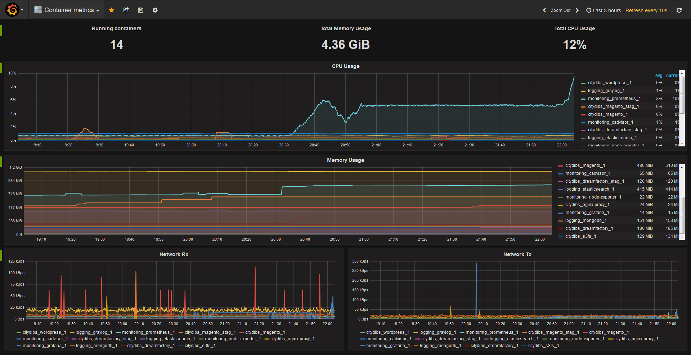

Docker Containers Monitor
=========================

This repository contains the open-source systems monitoring toolkit.

Directory structure
-------------------

* `prometheus/` — Prometheus service configuration
* `docker-compose.yml` — Environment for monitoring all containers


Initializing
------------

### Prerequisites

To configure the Docker daemon as a Prometheus target, you need to specify the metrics-address. The best way to do this is via the daemon.json, which is located at one of the following locations by default. If the file does not exist, create it.

`Linux:` /etc/docker/daemon.json
`Windows Server:` C:\ProgramData\docker\config\daemon.json
`Docker Desktop for Mac / Docker Desktop for Windows:` Click the Docker icon in the toolbar, select Preferences, then select Daemon. Click Advanced.
If the file is currently empty, paste the following:

  ```
  {
    "metrics-addr" : "127.0.0.1:9323",
    "experimental" : true
  }
  ```

### Getting started

1. Start the toolkit using Docker Compose:

    ```
    $ docker-compose up
    ```

2. Open grafana on `http://localhost:3000` and log into admin account with the credentials from docker-compose file.


Setting Data Sources
--------------------

1. Open the side menu by clicking the **Grafana icon** in the top header.
2. In the side menu under the Dashboards link you should find a link named **Data Sources**.
3. Click the + **Add data source** button in the top header.
   1. `Name:` **Name** The data source name. This is how you refer to the data source in panels and queries.
   2. `Type:` Select **Prometheus** from the Type dropdown.
   3. `Default:`	**Default** data source means that it will be pre-selected for new panels.
   4. `Url:`	The URL of your Prometheus server, **http://prometheus:9090**.
   5. `Access:`	**Proxy** - URL needs to be accessible from the Grafana backend/server, Browser = URL needs to be accessible from the browser.
4. Click on **Save and Test** Button.
   

Creating Dashboard
------------------

1. Open the side menu by clicking the **Grafana icon** in the top header.
2. In the side menu under the Dashboards link you should find a link named **Dashboards**.
3. Click the **Import** button in the dropdown menu.
4. Click on **Upload .json File** button in the popup window.
5. Select **docker-monitoring.json** file.
6. Under **Options > prometheus** select **Data Source** created earlier.
7. Click on Save and Open.

Dashboard Example
-----------------

